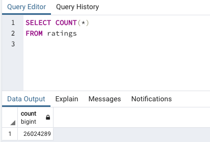
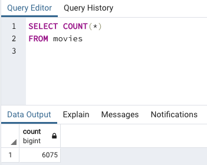

# Movies-ETL

## Project Overview

The purpose of this project was to aid a fictitious company called Amazing Prime in creating an automated data pipeline process for extracting, transforming, and loading movie data and ratings into existing tables.  In essense, the process involved refacoring a code to create a function within a jupyter notebook for inputting Wikipedia data, Kaggle data, and MovieLens rating data to perform an ETL process which would conveniently add the data to a PostgreSQL database.

---------------------------------------------
## Resources:
Data Sources: wikipedia, kaggle, MovieLens

Software:  Visual Studio Code 1.49.2, Python 3.8.3, Pandas 1.0.5,
Matplotlib 3.2.2, Numpy 1.18.5, SQLalchemy 1.3.18, PostgreSQL 12.4

---------------------------------------------

## Results

As a result of the analysis, an ETL function was succesfully created to read three data files, the Wikipedia and Kaggle data were extracted and transformed, and, finally, a movie database was created in PostgreSQL containing the results.  The tables in the PostgreSQL database were queried from the query tool to ensure the process worked correctly and the results of the query for the correct number of rows imported to the database are displayed accordingly below.

## Summary

From this project, it is evident the extract, transform, and load process is an extremely vital method for appropriately processing data to ensure the data is prepped prior to further analyzation.  By implementing the ETL process prior to analyzing a dataset, the resulting analysis becomes much more feasible and meaningful as it is better suited to provide useful insights within the data.